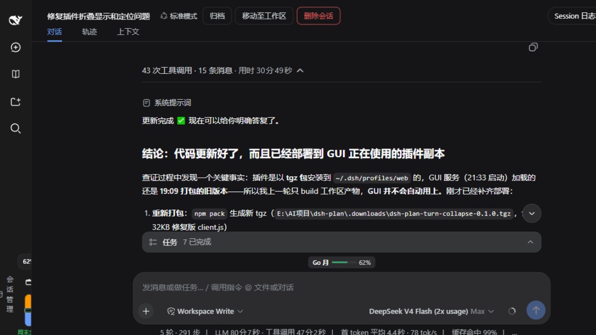

[English](README.md) | [中文](README.zh-CN.md)

# dsh-turnfold

[](LICENSE)
[](https://github.com/deepseek-ai/dsh-client-runtime)
[](https://github.com/UNscientific-9/dsh-turnfold/releases/tag/v0.3.1)

> An enhancement plugin for the **official turn fold bar** built into [DSH Web](https://github.com/deepseek-ai/dsh-client-runtime) 0.1.2. It takes over the official `turn-process` renderer with an identical look and behaviour, and adds four enhancements the official bar doesn't have — purely client-side.



*Live effect (DSH 0.1.2-alpha.1 + this plugin 0.3.1): the first half — `43 tool calls · 15 messages` — is the official count text; the faded `· took 30m 49s` tail is injected by this plugin. Click to fold/unfold; the expanded state survives refreshes.*

## The four enhancements

| Enhancement | What it does |
|---|---|
| **Duration + thinking segments** | Appends `· took X · M thinking segments` in a faded tertiary colour, computed by the plugin's own per-turn state machine |
| **Fold-decision persistence** | The official fold state is in-memory only (lost on refresh); the plugin records your choice in localStorage and restores it on reload |
| **completed whitelist (optional, off by default)** | The official bar folds every settled turn regardless of outcome; when enabled, aborted / errored / max-tokens turns stay expanded and render no bar at all |
| **Auto-load earlier history** | Scrolling near the top of a conversation automatically invokes the official `loadOlder()`, so long-session history arrives pre-folded |

- Purely front-end: no backend changes, no session-store changes, zero server-side residue after uninstall.
- Pinned to **DSH 0.1.2-alpha.1** (official `turn-process` fold bar, keyed slot `conversation.chat.node`, `useTurnData` injection surface).

## How it works

```
official ui-chat fold bar (turn-process)
        │  ctx.slots.register({ key:'turn-process', priority:-1 })   ← shadow render
        ▼
FoldBarView (this plugin's shadow renderer)
        │  official counts (node.data) + augment segment (useTurnData('turn-activity'))
        ▼
turn-activity definition ── per-turn state machine ── publishes {durationMs, thinkingSteps, reasonKind} at turn/end
```

Expand/collapse plays a height animation (Web Animations API, direction-reversible, `prefers-reduced-motion` aware); `foldable=false` follows the official renderer and renders nothing.

## Install

1. Get `dsh-turnfold-0.3.1.tgz` (see [Releases](https://github.com/UNscientific-9/dsh-turnfold/releases)) and put it in a fixed directory.
2. Edit the DSH web profile's `%USERPROFILE%\.dsh\profiles\web\package.json` and add the dependency:
   ```json
   {
     "dependencies": {
       "@UNscientific-9/dsh-turnfold": "file:D:/path/to/dsh-turnfold-0.3.1.tgz"
     }
   }
   ```
3. In the profile directory, run `pnpm install`, then restart DSH web and hard-refresh the browser (`Ctrl+Shift+R`).
4. The browser console should show `[dsh.turnfold] v0.3.1 loaded`, and completed turns get the official-style fold bar with a faded `· took X · M thinking segments` tail.

Requires DSH web **0.1.2-alpha.1** (0.1.1 has no official fold bar — this plugin does not apply).

## Configuration (localStorage)

| Key | Default | Effect |
|---|---|---|
| `dsh.turn-collapse.completedOnly` | unset | Set to `'1'` to keep aborted / errored / max-tokens turns expanded; remove the key to restore the official behaviour |
| `dsh.turn-collapse.autoLoad` | `'1'` | Set to `'0'` to disable auto-load of earlier history |

## Uninstall

Remove the `@UNscientific-9/dsh-turnfold` line from the profile `package.json`, run `pnpm install`, restart DSH web and hard-refresh. Everything the plugin owns lives in the browser (three localStorage keys + one `<style>` tag); removing it restores the pure official fold bar.

## Documentation

- Full user guide: [plugin/README.md](plugin/README.md)
- Architecture: [plugin/docs/architecture.md](plugin/docs/architecture.md)
- Manual verification checklist: [plugin/docs/manual-verification.md](plugin/docs/manual-verification.md)

## License

[MIT](LICENSE)
