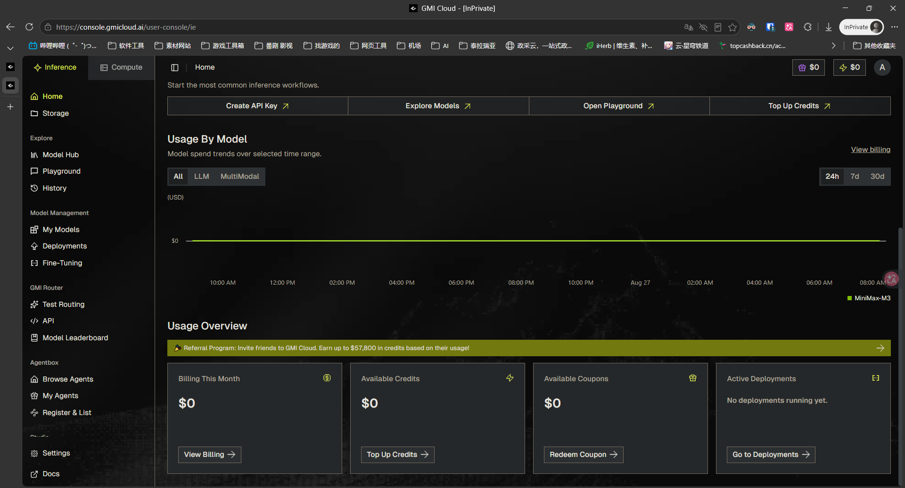

[English](README.md) | [中文](README.zh-CN.md)

# turn-collapse

[](LICENSE)
[](https://github.com/deepseek-ai/dsh-client-runtime)
[](https://github.com/UNscientific-9/turn-collapse/releases/tag/v0.2.8)

> [DSH Web](https://github.com/deepseek-ai/dsh-client-runtime) 的轮次折叠插件：agent 工作时，thinking / 工具调用 / 中间叙述保持完整流式可见；**一轮（turn）结束后，自动把活动块收纳成一行摘要**，让最终回答成为视觉主体。点击摘要可随时展开/收起，刷新后恢复选择。



## 它是什么

长 agent 轮次会产生大量中间输出：规划文本、工具调用、工具结果、重试、一段段思考。事后再看最终答案，意味着要滚动过所有这些。

这个插件监听 DSH 会话事件流。当一轮以 `reason.kind === 'completed'` 且存在最终消息结束时，它把活动块折叠成一行永久摘要 —— `本轮用时 2分38秒 · 7 次工具 · 3 段思考` —— 下方加一条低对比度分割线。点击摘要可展开/收起；你的选择会跨刷新保留。

插件**纯前端**：不改 DSH 后端、不改会话存储、不动任何用户数据。卸载后服务端和磁盘都不留痕迹。

## 效果

```
（上一轮内容）

用户消息……
› 本轮用时 2分38秒 · 7 次工具 · 3 段思考   ← 可点击
──────────────────────────────────  ← 分割线
最终回答……
```

## 核心功能

- **自动折叠** — 正常完成的轮次自动收起为一行摘要；中断 / 阻塞 / 报错的轮次保持展开，可手动折叠。
- **合成折叠条** — 长会话被窗口切掉的轮次也会生成合成折叠条（显示执行步骤数/工具数），不依赖是否加载到最早数据。
- **自动加载更早** — 滚动到会话顶部附近时自动调用 DSH 的"加载更早"，历史轮次边加载边折叠，无需手动点击。
- **状态持久化** — 折叠/展开选择存 localStorage，刷新、重开会话后恢复。早期轮次的折叠状态也会被记住（成员快照）。
- **位置正确** — 折叠条固定在**用户消息下方、该轮回复正文上方**（0.2.6 锚点修复）。

## 安装

1. 已安装 DSH web（`dsh` CLI 可用），版本 0.1.1-rc.2 系列。
2. 编辑 `%USERPROFILE%\.dsh\profiles\web\package.json`，在 `dependencies` 里加一行：
   ```json
   {
     "dependencies": {
       "@dsh-plan/turn-collapse": "file:D:/path/to/dsh-plan-turn-collapse-0.2.8.tgz"
     }
   }
   ```
3. 在 profile 目录执行 `pnpm install`，重启 DSH web，浏览器硬刷新（`Ctrl+Shift+R` / `Cmd+Shift+R`）。
4. 浏览器控制台应出现 `[dsh.turn-collapse] v0.2.8 loaded`。

## 兼容与卸载

| 项 | 说明 |
|---|---|
| DSH 兼容版本 | `@deepseek-ai/dsh-client-runtime` / `dsh-client-ui-conversation` / `dsh-session` 0.1.1-rc.2 |
| 卸载 | 从 `%USERPROFILE%\.dsh\profiles\web\package.json` 删除依赖行，执行 `pnpm install`，重启 + 硬刷新 |
| 清空折叠状态 | 浏览器控制台：`localStorage.removeItem('dsh.turn-collapse.v1')`，刷新 |

## 配置（localStorage）

| Key | 默认 | 作用 |
|---|---|---|
| `dsh.turn-collapse.autoLoad` | `'1'` | 设为 `'0'` 关闭"滚动近顶自动加载更早" |
| `dsh.turn-collapse.debug` | 未设 | 设为 `'1'` 在控制台输出 reconcile 诊断日志 |

## 文档

- 完整使用指南与 FAQ：[plugin/README.md](plugin/README.md)
- 架构（状态机 + DOM contract）：[plugin/docs/architecture.md](plugin/docs/architecture.md)
- UI / CSS 规范：[plugin/docs/ui-spec.md](plugin/docs/ui-spec.md)
- DSH 版本升级适配清单：[plugin/docs/maintenance.md](plugin/docs/maintenance.md)

## 许可

[MIT](LICENSE)
