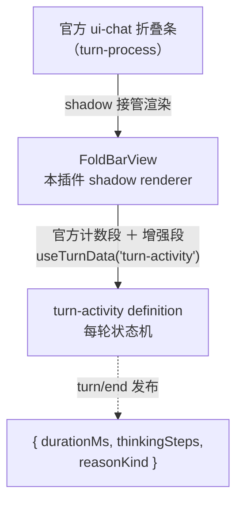

<div align="center">

[English](README.md) | [中文](README.zh-CN.md)

# dsh-turnfold

[](LICENSE) [](https://github.com/deepseek-ai/dsh-client-runtime) [](https://github.com/UNscientific-9/dsh-turnfold/releases/tag/v0.3.1) 

> [DSH Web](https://github.com/deepseek-ai/dsh-client-runtime) 0.1.2 内置官方轮次折叠条的**增强插件**——
> 以相同的外观与行为接管官方 `turn-process` 渲染，纯前端叠加四项官方没有的增强


*`43 次工具调用 · 15 条消息` 为官方计数，灰色「· 用时 30分49秒」为本插件注入；点击开合，刷新后自动恢复之前的展开状态。*

</div>

---

## 四项增强

| 增强 | 说明 |
|---|---|
| **用时 + 思考段数** | 折叠条追加 `· 用时 X · M 段思考`（tertiary 色弱化显示），数据来自插件自有的轮次状态机 |
| **展开决策持久化** | 官方折叠条的展开状态是内存态（刷新即失）；插件把你的展开选择写 localStorage，刷新/重开后恢复 |
| **completed 白名单**（可选，默认关） | 官方对轮次终结一律折叠（不区分原因）；开启后中断/报错/超限的轮保持展开且不渲染折叠条 |
| **自动加载更早历史** | 滚动到会话顶部附近时自动调用官方 `loadOlder()`，长会话历史边加载边折叠 |

> 纯前端插件：不改 DSH 后端、不改会话存储，卸载后服务端零残留。
> 锁定 **DSH 0.1.2-alpha.1**（官方 `turn-process` 折叠、keyed slot `conversation.chat.node`、`useTurnData` 注入面）。

---

## 工作方式



接管方式：`ctx.slots.register({ key: 'turn-process', priority: -1 })`，同 key 注册中 lowest priority 优先生效。展开/收起带高度动画（Web Animations API 驱动，动画中可反向，`prefers-reduced-motion` 下跳过）；`foldable=false` 时跟随官方渲染器不渲染。

---

<details>
<summary><b>安装</b>（4 步）</summary>

1. 拿到 `dsh-turnfold-0.3.1.tgz`（见 [Releases](https://github.com/UNscientific-9/dsh-turnfold/releases)），放到一个固定目录（路径不要带空格）。
2. 编辑 DSH web profile 的依赖文件 `%USERPROFILE%\.dsh\profiles\web\package.json`，在 `dependencies` 里加一行（路径改成实际位置）：

   ```json
   {
     "dependencies": {
       "@UNscientific-9/dsh-turnfold": "file:D:/path/to/dsh-turnfold-0.3.1.tgz"
     }
   }
   ```

3. 在 profile 目录执行 `pnpm install`，重启 DSH web，浏览器硬刷新（`Ctrl+Shift+R`）。
4. 浏览器控制台出现 `[dsh.turnfold] v0.3.1 loaded`，已完成回答前出现官方样式折叠条，计数后带灰色 `· 用时 X · M 段思考`。

需要 DSH web **0.1.2-alpha.1**（0.1.1 无官方折叠条，本插件不适用）。

</details>

<details>
<summary><b>配置</b>（localStorage）</summary>

| Key | 默认 | 作用 |
|---|---|---|
| `dsh.turn-collapse.completedOnly` | 未设 | 设为 `'1'` 后中断/报错/超限的轮不再折叠；删除该键恢复默认（尊重官方） |
| `dsh.turn-collapse.autoLoad` | `'1'` | 设为 `'0'` 关闭"滚动近顶自动加载更早" |

</details>

<details>
<summary><b>卸载 / 回滚</b></summary>

从 profile 的 `package.json` 删除 `@UNscientific-9/dsh-turnfold` 依赖行，执行 `pnpm install`，重启 DSH web 并硬刷新。插件全部影响都在浏览器侧（三个 localStorage 键 + 一个 `<style>` 标签），移除后刷新即回到纯官方折叠条，服务端无残留。

</details>

---

## 文档

[完整使用指南](plugin/README.md) · [架构说明](plugin/docs/architecture.md) · [手工验证清单](plugin/docs/manual-verification.md)

## 许可

[MIT](LICENSE)
