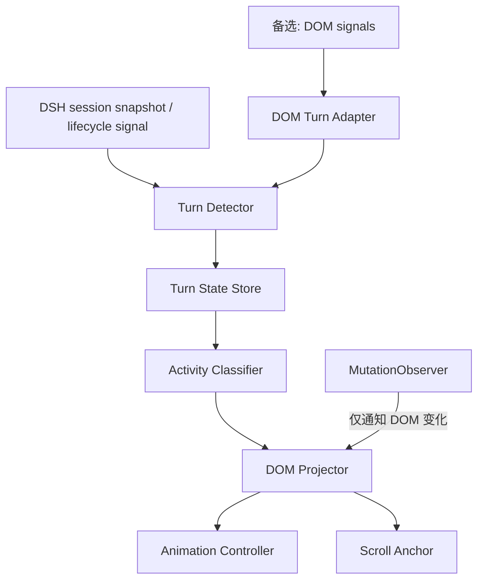

# DSH Web「Codex / ZCode 式轮次收纳」插件 V1 调研与实施计划

## 执行摘要

基于你提供的真实截图、OpenAI Codex 官方开源协议/Issue，以及 ZCode 官方产品与文档，V1 最合理的产品模型是：**执行过程是一个可折叠 activity region，最终回答永远位于其外部；最终回答开始流式输出时自动收起 activity，并在二者之间仅保留一条低对比度长分割线。**

Codex 已实际采用 `Worked for Xs` 折叠工作区；OpenAI 的公开 Issue 也明确认为 thinking/working 应隐藏在该区域，而直接回答必须始终位于外部。citeturn9view0turn9view1 Codex app-server 则提供 `turn/started`、`item/*`、`turn/completed` 和 reasoning/tool 类型，这说明**可靠实现应基于结构化 turn 状态，而非纯 DOM 猜测**。citeturn5view0turn5view2

ZCode 官方资料同样强调“过程流式展示、工具结果折叠为摘要、需要时展开”；Goal 模式还明确使用 divider 将 iteration 与最终 wrap-up summary 分隔。citeturn3view3turn3view4 但本次检索未发现 ZCode 桌面 conversation renderer 的公开源码，因此其精确颜色、动画和间距应以**你提供的截图**作为 V1 的主要视觉基准，而非声称复刻内部实现。citeturn1search2turn1search5

**建议：采用“状态/快照驱动 + DOM projector”方案；MutationObserver 仅发现 DOM 和触发 reconcile，不负责判断 turn。**预计 V1 前端工作量约 **7–9 人日**。

## 目标、约束与参考分析

目标是让 DSH 在 agent 工作时保持 thinking/tool/中间叙述完整流式可见；一旦**最终回答开始输出**，此前 activity 自动收纳成永久可见的 summary，最终答案成为视觉主体。异常、中断、等待授权状态不得误收。

V1 明确不做 tool UI 重构、统计面板、设置页、高级 timeline、token/费用展示；优先级假设为：**正确状态判定 > 不跳屏 > 展开可恢复 > 动画 > 像素精修**。

| 属性 | Codex / ZCode 调研结论 | DSH V1 |
|---|---|---|
| 内容边界 | Codex 将 working 与直接回答分离。citeturn9view0 | activity / final 两区 |
| 分割线 | 你的截图显示单条、长、极低对比 | **仅一条，位于两区之间** |
| Summary | Codex 为 `Worked for Xs`；ZCode使用紧凑 progress/summary。citeturn7search0turn3view2 | `本轮用时 X · X 次工具 · X 段思考` |
| 默认折叠 | Codex IDE 已存在完成后默认折叠行为。citeturn9view3 | final 开始时自动折叠 |
| Tool | ZCode 明确支持 tool call 摘要折叠/展开。citeturn10search0 | V1 保留 DSH 原 tool UI |
| Final | 应始终为 turn 最终视觉项；晚到 reasoning 不应跑到答案后。citeturn9view2 | final 永不纳入折叠 |
| 动画 | 官方未公开具体参数 | 220ms 高度/透明度 |
| 滚动 | 官方未公开稳定算法 | 自建 scroll anchor |
| 可访问性 | 产品实现细节未公开 | Disclosure ARIA 模式 |

**已知 DSH DOM 基础（来自现有对话/截图）**：`data-turn-tail`、`data-conversation-scroll`，tool 的 `data-tool/data-state/data-chat-call-id/data-chat-anchor-key`，以及 `--dsw-alias-label-tertiary`。这些可以作为 projector 定位手段，但不应成为业务状态唯一来源。

## 技术实现方案

### 推荐：状态驱动 projector



状态机建议：

`RUNNING → FINAL_STREAMING → COLLAPSED → EXPANDED`

旁路状态为 `WAITING_APPROVAL / INTERRUPTED / FAILED`，三者保持展开。Codex 协议本身区分 `completed / interrupted / failed`，且 item 生命周期独立于 turn；甚至 subagent completion 可能晚于 `turn/completed`，因此 DSH 也应允许迟到事件重新归入 activity，而不能简单按 DOM 到达顺序追加。citeturn5view0turn5view2

核心模块：

`TurnDetector` 负责 turnId、final-start、异常状态；`ActivityClassifier` 区分 thinking/tool/intermediate/final；`StateStore` 保存 `{sessionId,turnId,expanded}`；`DOMProjector` 只加 wrapper/class/summary；`AnimationController` 控制收展；`ScrollAnchor` 在布局变更前后按锚点 `getBoundingClientRect().top` 差值补偿 scrollTop。

**MutationObserver 只做 dirty notification**，每帧至多一次 `requestAnimationFrame(reconcile)`；不得在 observer 中持续扫描整页或直接判断“这是不是最终答案”。Codex 已出现 reasoning UI 与布局观察导致 ResizeObserver 循环的问题，可作为避免同步测量→修改→再测量的反例。citeturn2search5

### 备选：纯前端 DOM 投影

若 DSH 无 snapshot/lifecycle API，则用 `data-turn-tail`、tool 属性和 assistant DOM 顺序推导 turn，建立 `DOMTurnAdapter → 同一状态机`。优点是不改后端；缺点是 final-start、interrupt、并发 tool 和 DOM 重构更易误判，因此只能作为兼容层。

需要 DSH 提供或确认（2026 实施前已在 DSH 0.1.1-rc.2 本机源码逐项核实，非推断）：

| 能力 | 确认结果（源码位置） |
|---|---|
| turn 生命周期事件 | ✅ `turn/start`、`turn/end`（`reason: TurnEndReason`，含 completed/aborted/blocked/error/max-tokens/interrupted 六种）、`step/start`、`step/end`（`dsh-session/lib/types/types.d.ts`；TurnEndReasonMap 见同文件 135–167 行） |
| final-output 开始/完成信号 | ✅ `assistant/message` 事件（`interrupted?: true` 标记取消前缀）+ `assistant/chunk` 流式块（`reasoning-delta`/`text-delta`/`tool-call-delta`/`block-end`/`usage`/`finish`，`dsh-llm/lib/types/types.d.ts` 287–317 行） |
| 稳定 turnId / turn snapshot | ✅ `TurnLocation{turn,start,end,status:'open'\|'closed',steps,data}`、`ConversationTimelineSnapshot{turnOrder,turns}`（`dsh-client-runtime/lib/types/client/contract/conversation.d.ts`） |
| turn-tail 明确信号 | ✅ `turn-tail` Conversation Node + `TurnTailChatData{turn,seq,time,closing,ttftMs,tokensPerSecond}`，在 `turn/end` 时以 immediate 物化（`dsh-client-ui-conversation/lib/client.js` 9237–9290 行） |
| tool/reasoning 类型与状态 | ✅ `tool/call{turn,step,callId,name,arguments}`、`tool/result{turn,step,message,error?,meta?}`（事件 data 自带 turn/step）；reasoning 为 `assistant/chunk.chunk.type === 'reasoning-delta'` |
| interrupted / failed / approval 状态 | ✅ `assistant/message.interrupted`、`turn/end.reason.kind`（aborted/error/interrupted/…）、`PendingInteractionStatus = 'approval' \| 'plan-review' \| 'question'`（`dsh-client-runtime/lib/types/client/sessions/pending.d.ts`，来自 `approval/requested` mux frame） |
| 是否允许后端修改 | ✅ 不需要。纯前端插件：`ctx.conversationEvents.register(definition)` + `ctx.slots.inject("conversation.chat.node", ...)` 注册制；`dsh-client-ui-deliverables`（已安装、Web patch 已组合）即官方先例，连 `conversation.chat.turnTail` 空位都已存在 |

**实施修正（相对原始调研）**：
1. **推荐方案直接落地**："备选：纯前端 DOM 投影"降级为兜底兼容层，其预留的 1–2 人日适配从 V1 预算中移除。
2. **自动折叠唯一触发**：`turn/end` 且 `reason.kind === 'completed'` 且该 turn 存在 `assistant/message`。其余 reason（aborted/blocked/error/max-tokens/interrupted）一律不折叠——满足"异常自动折叠率 0"硬门槛，且不依赖任何 final-start 猜测。
3. **summary 行位置**：自建 `turn-activity` 节点，anchorSeq 取 final step 之前最后一个 activity 事件 seq，天然排在 final assistant 行之前；`turn-tail`（产物行）仍在 final 之后，两者互不冲突。
4. **浏览器目标**：默认现代 Chromium/Edge/Firefox/Safari 最新两个大版本 + `prefers-reduced-motion`；打包产物为 dsh-client-modules 的 `__ModuleLoader__.load` 单文件格式。

## 开发任务与验收

| 里程碑 / 任务 | 验收标准 | 人日 | 优先级 |
|---|---|---:|---|
| 基线探针：记录真实 turn DOM/事件 | 5类场景可稳定映射 turn | 0.75 | P0 |
| TurnDetector + 状态机 | 正常/失败/中断/approval 判定正确 | 1.25 | P0 |
| ActivityClassifier | final 永不进入 activity | 0.75 | P0 |
| DOM Projector + summary | 幂等，无重复 summary/line | 1.0 | P0 |
| 收展与状态持久化 | 点击、刷新后状态恢复 | 1.0 | P0 |
| ScrollAnchor | 收起长过程视口漂移 ≤2px（非边界钳制时） | 1.0 | P0 |
| 动画/主题/a11y | 键盘、dark/light、reduced-motion 通过 | 0.75 | P1 |
| 长会话与异常回归 | 100+ activity item 无明显卡顿/错位 | 1.0 | P0 |
| 文档/demo/兼容说明 | 可安装、可复现、可回滚 | 0.5 | P1 |

总计约 **8 人日**；若只能 DOM 推断，预留额外 **1–2 人日**用于适配和回归。

## UI、交互与测试规范

建议基准：

```css
--dsh-turn-summary-color: var(--dsw-alias-label-tertiary);
--dsh-turn-divider-opacity: .18;
```

分割线 `1px / 100%`，activity→线间距约 `12–16px`；线→summary `7–9px`；summary `13px/20px`；summary→final `6–8px`。不加卡片、圆角或 hover 背景，仅允许箭头/文字透明度轻微变化。动画建议 `220ms cubic-bezier(.2,0,0,1)`；系统要求减少动画时取消非必要 transition。citeturn8search1

折叠后的目标形态严格为：

```text
› 本轮用时 2分38秒 · 7 次工具 · 3 段思考
────────────────────────────────
最终答案……
```

即 **summary 属于被折叠后的执行区域，唯一分割线位于 summary 与 final answer 之间**；这一点以你最后确认的截图为设计基准。

交互节点使用真实 `<button>` 或等效 Disclosure，维护 `aria-expanded` 与 `aria-controls`，Enter/Space 可操作且 `:focus-visible` 清晰；这是 WAI-ARIA Disclosure 的标准语义。citeturn8search0turn8search2

自动化测试至少覆盖：状态机、重复 reconcile、并发 tools、late tool/reasoning、session rehydrate、持久化；E2E 覆盖 50/100+ item 长 turn、展开/折叠、连续多轮及滚动锚点。手测矩阵覆盖正常成功、tool error、用户 Stop、approval waiting、空 final、中间 commentary、刷新恢复、窄窗口和 light/dark。

**发布硬门槛**：final 误折叠率 0；异常 turn 自动折叠率 0；summary 重复 0；正常锚点漂移 ≤2px；连续 20 轮无 DOM 泄漏/重复 listener；键盘完整可操作。

## 风险、替代方案与交付物

最大风险是 **final-start 误判**。Codex 已出现 commentary 被误塞入 `Worked for`、以及 reasoning 出现在 final 后面的实际 bug，说明“视觉到达顺序≠语义归属”。citeturn9view1turn9view2 缓解措施是优先使用 DSH 结构化 phase；没有则保持保守——**不确定就不自动折叠**。

页面抖动通过锚点补偿和批量 DOM commit 控制；性能通过 turn scoped 查询、WeakMap 缓存和 rAF 合并 observer 事件控制；样式冲突全部使用插件命名空间/data attribute，不依赖漂移的 CSS Modules 类名。

交付物必须包含：插件源码与构建产物、状态机/DOM contract 文档、CSS/UI spec、自动化测试、异常场景 fixture、安装/回滚说明、1–2 分钟 demo 视频，以及一份“DSH DOM/API 变化时如何适配”的维护文档。

验收 checklist：**运行时过程不提前隐藏；final 开始即收纳；summary 永久存在；只有一条分割线且位于 summary 与 final 之间；final 永不折叠；异常保持展开；刷新恢复人工选择；长 turn 不跳屏；键盘/读屏/reduced-motion 可用。**

## 待确认项（2026 实施更新）

开发前接口问题已在本机 DSH 0.1.1-rc.2 源码确认（见上文表格），不再阻塞：

- ~~DSH 是否提供明确的 final-output-start / message phase~~ → 已确认：`assistant/message` + `turn/end.reason`。
- ~~DSH 是否提供稳定 turnId、turn snapshot、turn-tail~~ → 已确认：`TurnLocation` / `ConversationTimelineSnapshot` / `turn-tail` 节点。
- ~~是否能读取 interrupted / failed / approval-waiting 的结构化状态~~ → 已确认：`turn/end.reason.kind` + `assistant/message.interrupted` + `PendingInteractionStatus`。
- ~~仅允许前端插件，还是可增加 DSH 后端/客户端事件~~ → 已确认：纯前端插件足够（`conversationEvents.register` + `slots.inject`）。
- **目标浏览器及最低版本**：仍按默认现代浏览器处理（Chromium/Edge/Firefox/Safari 近两个大版本），无额外适配承诺。
- **`--dsw-alias-label-tertiary` 之外是否有正式 divider/border token**：仍按 `--dsw-alias-label-tertiary` + `--dsw-alias-border-l1/l3`（已在官方包 CSS 中确认使用）实现，不额外引入 token。

**剩余唯一真实风险**：DSH 版本演进（rc 版本 DOM/接口变动）。缓解：README 固定兼容版本、维护文档提供适配检查清单、插件 DOM 依赖面最小化（只依赖 `data-chat-anchor-key`/`data-chat-flow-kind` 行属性 + 事件接口）。